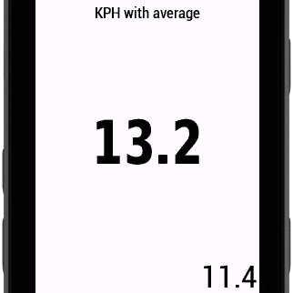
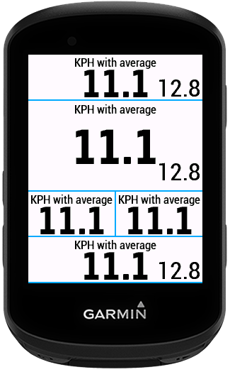
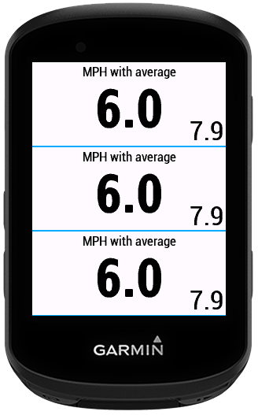
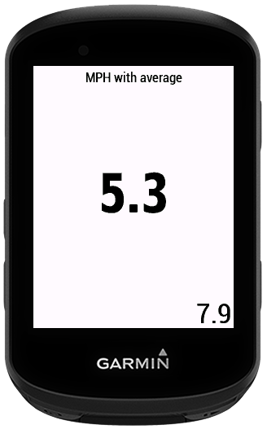

# Speed With Average

This Data Filed displays current speed and average speed in selected unit KPH or MPH in one data field.
If data field is too small, then it only displays the current speed without average.

To change unit you need change this unit in the device settings.

## What’s New

1.0.0 - Initial version

## Screenshots

